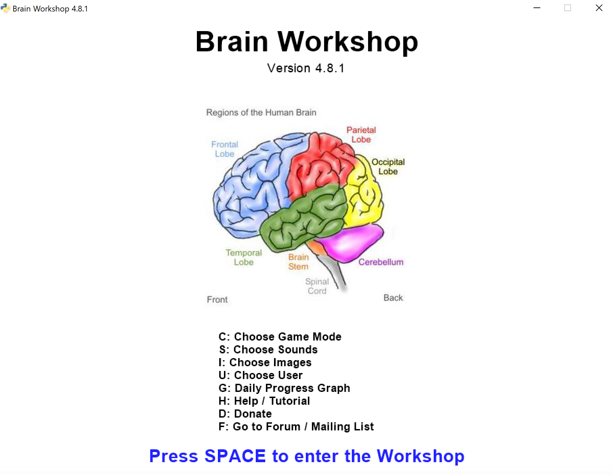
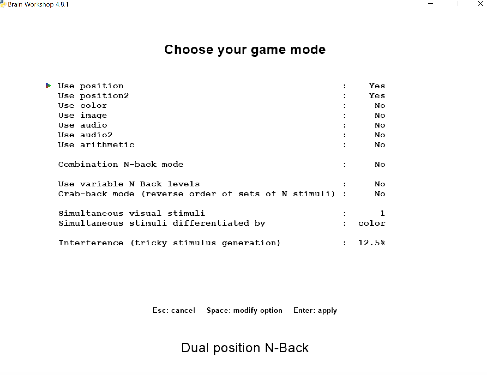
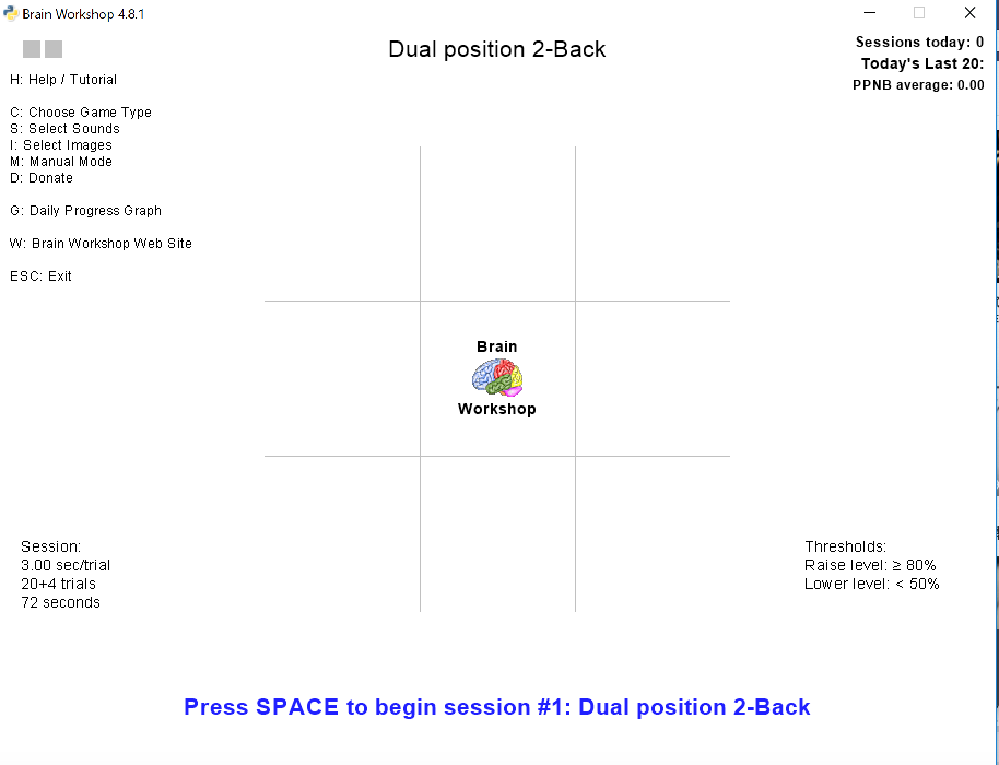
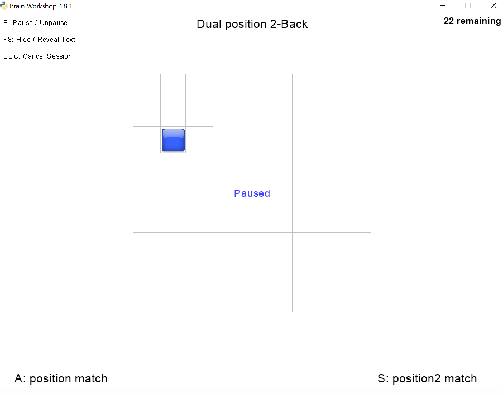
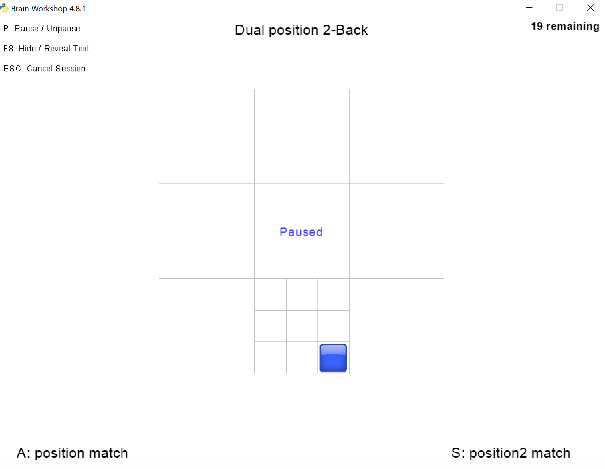

# Brainworkshop 6

# What is this?
This is a fork of the popular working memory training software BrainWorkshop.  In January 2019 there was a research published that investigates the critical role of interference control training in n-back training games. The paper can be found at https://www.sciencedirect.com/science/article/pii/S001002771830218X. I added a new mode "dual position" that incorporates the findings in interference control. 

# Notes
You need Python 2 for this to work. 
Git clone my directory to your local directory; 
open brainworkshop.pyw with python IDLE;
Press F5 to start. 

# How to play?
Press C to choose game mode

Select position and position 2

Press Space to enter the game

Press A for a position match for the grid. For example, for dual position 2 back, if the grid lines appear in the top left corner, bottom right cornor, and top left corner again, then we should press A because trial 1 matches with trial 3 for the grid.

Press S for a position match for the square. For example, for dual position 2 back, if the square appears in the top right corner, bottom right cornor, and top right corner again, then we should press S because trial 1 matches with trial 3 for the square.

